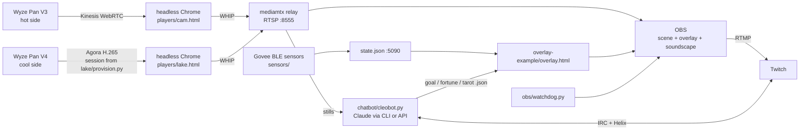

# ClaudeWyze4Sln — a 24/7 talking animal cam on Twitch, and the Wyze Cam Pan V4 fix that made it possible

**Live demo:** [twitch.tv/princesscleolive](https://www.twitch.tv/princesscleolive) — Princess Cleo, a ball python in Southern California, streaming around the clock from two Wyze cameras. She answers chat as herself, looks at her own cameras before she tells you what she's doing, clips herself when she moves, reads tarot, and tells fortunes. Everything on that stream comes from this repository.

**Start here:** [QUICKSTART.md](QUICKSTART.md) — `git clone`, `./install.sh`, and a blank Apple-silicon Mac is live on Twitch in about 20 minutes. `./doctor.sh` checks every layer afterwards.

**Here for the Pan V4 / `IOTC_ER_UNLICENSE` problem?** Read [WRITEUP.md](WRITEUP.md): why the V4 never uses TUTK, the Agora ("lake") path Wyze's own web viewer takes, and a step-by-step reproduction with `lake/provision.py` + `players/lake.html` + a local relay so OBS, ffmpeg or Home Assistant can pull it as RTSP.

## What you end up with

A Mac (we use a Mac mini) that, from power-on and with nobody touching it:

1. **Pulls two Wyze cameras** through Wyze's own cloud paths (Kinesis WebRTC for the Pan V3, Agora H.265 for the Pan V4), decodes each in a headless Chrome and republishes them locally as RTSP.
2. **Composites a 1080p scene in OBS**: both cameras side by side under a procedural, weather-aware overlay (live temperatures and humidity from Bluetooth sensors with 6-hour charts, a "habitat check" verdict, feeding log, sunrise/sunset scenery that shifts from night to dawn to day to dusk, a follower/subscriber goal bar).
3. **Plays a generative soundscape**: crickets, frogs, birds, wind, rain and thunder synthesized live from the real weather and time of day, no audio files, no licences.
4. **Streams to Twitch 24/7** with a watchdog that restarts the stream if Twitch drops the ingest, and players that reboot a camera when its stream goes stale.
5. **Runs a chat bot with a personality**, backed by Claude:
   - answers every real message in the animal's voice (spicy, opinionated, accurate about husbandry, never diagnoses illness, sends people to a vet);
   - **looks at the cameras** ("what are you doing?") by grabbing stills and reading them with a vision model;
   - **clips itself** on Twitch when the sensors see movement, and on request (`clip`);
   - **tarot readings**: three cards from a full 78-card Rider-Waite deck flip on the overlay with lightning and sound, then a real reading; follow-up questions stay inside that spread;
   - **fortunes** from a Zoltar-style crystal-ball booth on the overlay;
   - remembers viewers (visits, their pet's name, what they talked about), court ranks, votes and quiz rounds, welcome and follow thanks, model-written idle lines only when someone is watching;
   - a token budget that scales with viewer count, a kill switch, an allowlist of the only links it may ever post, and no personal data collection (addresses and such are refused in chat).
6. **Heals and reboots itself**: launchd brings every piece up at login; camera, relay, OBS and bot each restart independently.

Cost to run: the Wyze cameras and a Mac you already have, one Govee Bluetooth thermometer per side (about $12 each), Twitch (free), and the Claude subscription the bot uses through the `claude` command (or an API key). No Wyze Cam Plus needed for this path.

## Architecture

## Requirements

- macOS on Apple silicon (launchd, Chrome path and OBS config are Mac-specific; the camera path itself is portable).
- Docker via Colima (`brew install colima docker docker-compose`), Google Chrome 130+, OBS 30+, `mediamtx`, ffmpeg, Python 3.9+.
- A Wyze account with an API key pair; the cameras set up in the Wyze app.
- A Twitch account for the channel (the bot posts as the channel account) and a Twitch developer app (free).
- For the bot's brain: the `claude` command signed in to a Claude subscription, or `ANTHROPIC_API_KEY`.

## Adapting it to your animal

- **Overlay text and facts:** `overlay-example/overlay.html` (name, species line, healthy ranges) and `overlay-example/facts.json`.
- **Bot voice and knowledge:** the system prompt in `chatbot/cleobot.py` (`_system_prompt`) and `chatbot/knowledge.json` (curated answers; the vet answer is always sent verbatim). Replace the ball-python husbandry with yours and keep the "a vet, not chat" rule.
- **Resources:** `RESOURCES` in `cleobot.py` is the only set of links the bot may ever post.
- **Sensors:** `sensors/` reads Govee H5075-class thermometers over Bluetooth; anything that can write `state.json` works.
- **One camera only?** Use a single decoder agent and one pane in the OBS scene; the overlay handles a missing side.

## Known limits

- The whole video path is cloud-dependent (camera → Wyze/Agora → your Mac). A Wyze password change, a new API key or a web-app rewrite can break it; the constants are documented in WRITEUP.md.
- Pan/tilt is not controllable from here (the bridge's control channel doesn't reach the cameras from inside a NAT'd Docker VM; Agora carries video, not PTZ). Use the Wyze app, and `campause.sh` to release a camera for a few minutes.
- OBS's built-in browser cannot decode H.265, hence the headless-Chrome relay.
- Twitch Affiliate needs an average of 3 viewers; a 24/7 stream with empty nights lowers that average.

## Credits and licence

MIT. Tarot art is the 1909 Rider-Waite-Smith deck (public domain, scans from Wikimedia Commons). The Agora Web SDK is downloaded by `players/get-agora-sdk.sh` under Agora's terms, not redistributed. Built with Claude Code; the Wyze API details were captured from Wyze's own web viewer. If this helped you, star the repo and say hi in Cleo's chat. 🐍

---

## snakecam — hot/cool side to Twitch (+ YouTube) via OBS

Both cams come down from Wyze's cloud as WebRTC (Kinesis for the Pan V3, Agora/H.265 for the Pan V4).
Each is decoded by its own invisible headless Chrome (launchd com.snakecam.hotcam / .coolcam) and re-published
over WHIP into a local relay (mediamtx); OBS reads rtsp://127.0.0.1:8555/hotcam and /coolcam as Media Sources.
OBS never runs WebRTC itself (its browser engine is too old and too flaky for it).
OBS composites both + the overlay and streams RTMP to Twitch.
See STATUS.md for how each camera is reached and why.
Unattended on the Mac mini: launchd starts OBS streaming at login, restarts on crash.

## Layout
    docker-compose.yml        the Wyze bridge + lake-provisioner sidecar (needs .env)
    lake/provision.py         Agora session provisioner for the Pan V4 (runs in the sidecar)
    overlay/cam.html          Kinesis WebRTC player  (hot cam)   -> :5050/static/snakecam/cam.html?cam=<name>
    overlay/lake.html         Agora player + WHIP relay mode (cool cam) -> run only by the headless decoder
    overlay/lake/             session files written by the provisioner (renewed every 45 min)
    relay/mediamtx.yml        local relay: WHIP in :8890, RTSP out :8555
    launchd/com.snakecam.relay.plist    launchd: the relay
    launchd/com.snakecam.hotcam.plist   launchd: headless Chrome decoding the hot cam into the relay (Kinesis; &profile=lowest = 360p)
    launchd/com.snakecam.coolcam.plist  launchd: headless Chrome decoding the cool cam into the relay (Agora, H.265)
    launchd/com.snakecam.chatbot.plist  launchd: CleoBot;  launchd/com.snakecam.watchdog.plist: the stream watchdog
    chatbot/                  CleoBot (cleobot.py), Twitch auth (auth.py), knowledge.json, tarot.json (78-card deck)
    sensors/                  Govee Bluetooth thermometer reader + motion hub (state.json on :5090)
    overlay-example/          the overlay page, generative soundscape, facts, the public-domain tarot card scans
    Start Snakecam.command / Stop Snakecam.command   double-click in Finder
    discover.sh               prints camera names/models once the bridge is up
    obs/SnakeCam.json         scene: Hot Side | Cool Side, overlay on top
    obs/basic.ini             1080p30, Apple hardware H264, 4500 kbps
    obs/install-obs-config.sh drops the above into OBS, fills in camera names
    launchd/com.snakecam.obs.plist launchd: OBS --startstreaming, KeepAlive
    overlay/overlay.html      labels + clock. THIS is where graphics go later.
    fallback-ffmpeg/          headless ffmpeg version, no OBS. Kept as plan B.

## One-time setup
1. Fill .env: Wyze login + API key pair.  (Twitch key goes into OBS, step 5.)
2. docker compose up -d           then  ./discover.sh
3. Put the exact camera names into CAM_HOT / CAM_COLD in .env
4. obs/install-obs-config.sh
5. Open OBS once: Settings > Stream > paste Twitch key. Check the preview.
   Drag/resize panes if you like; it's just an OBS scene now.
6. cp obs/com.snakecam.*.plist sensors/com.snakecam.sensors.plist ~/Library/LaunchAgents/  then see 'Switch on'
7. Mac: System Settings > Users > auto-login this user; Energy > never sleep.

## Hot cam quality
The Pan V3's Wi-Fi link drops 25-30% of packets at 1080p, so cam.html asks the camera for its lowest
profile (360p) over the Kinesis data channel (&profile=lowest|highest|keep|1080p|360p in the decoder URL,
obs/com.snakecam.hotcam.plist). Fix the Wi-Fi, then switch to &profile=highest.
The cool decoder asks the provisioner for a FRESH Agora session on every start (POST :5051/provision/<cam>):
create-connection is what makes the Pan V4 join the channel; a cached session leaves it silent.

## Overlay (overlay/overlay.html, served by the bridge at :5050/static/snakecam/overlay.html)
A 1920x1080 web page OBS draws over the two feeds. Everything is configured at the top of its script:
- SNAKE: healthy temperature ranges, fallback day/night hours, the facts that rotate every 24s.
- WEATHER: lat/lon for Open-Meteo (free, no key). Outside temp/condition, high/low, and the REAL
  sunrise/sunset drive the scenery: night (onyx/lapis, stars, moon) -> dawn -> day (sandstone, sun) -> dusk.
  Preview any scene with ?phase=dawn|day|dusk|night.
- Cards: hot/cool with 6h chart + today's high/low + "updated Ns ago"; "Habitat check" (a verdict from the two
  sensors against ball-python targets, plus her prime time from the real sunset — nothing claimed from the cameras);
  Feeding (last ate, declined, next attempt, last shed).
- Data comes from the sensor service's hub: http://127.0.0.1:5090/state.json (readings, motion, 24h samples).
  The player pages post motion scores to it twice a second. Port 5090 because Chrome refuses 5060.
Refresh the layer without restarting OBS: right-click Overlay > Refresh (or obs-websocket refreshnocache).
OBS also carries a subtle "Warm tint" colour filter on both feeds so night-vision footage isn't flat grey.
Feeding log: ./feed.sh ate | refused | shed | plan YYYY-MM-DD | interval N

## Switch on (once) - or just double-click 'Start Snakecam.command'
    brew services start colima
    launchctl load ~/Library/LaunchAgents/com.snakecam.relay.plist
    launchctl load ~/Library/LaunchAgents/com.snakecam.hotcam.plist
    launchctl load ~/Library/LaunchAgents/com.snakecam.coolcam.plist
    launchctl load ~/Library/LaunchAgents/com.snakecam.sensors.plist
    launchctl load ~/Library/LaunchAgents/com.snakecam.obs.plist

Watching the cool cam yourself: http://localhost:8890/coolcam/  (the relay's viewer). NEVER open the
lake.html player page while the decoder runs - it joins Agora with the same session and kicks the decoder off.

## Stream watchdog (obs/watchdog.py)
Twitch can end the ingest session (it did after a channel rename) while OBS keeps sending into a dead
connection and never reconnects. The watchdog asks Twitch once a minute whether the channel is live; if OBS says
streaming but Twitch says offline for 3 minutes, it restarts OBS's stream output. Uses the chat bot's token.
launchd agent com.snakecam.watchdog; log in ~/Library/Logs/snakecam-watchdog.log.

## Soundscape (overlay/ambience.html)
A generative savanna-edge soundscape, synthesized live (no files, no licences) and switched by the same
sunrise/sunset as the overlay. Nothing loops: every voice is an individual with its own pitch, position, distance
and habits, and densities drift over minutes so it never settles into a pattern. Night: wind, three kinds of
cricket (chirpers, tree-cricket trills, ground-cricket ticks) that sing in bouts and thin toward dawn, a peeper
chorus in waves plus deep croakers, a nightjar churr, an owl. Dawn: a chorus of six bird species that fades over
the hour after sunrise. Day: wind with gusts and leaf rustle, birds and doves, cicada choruses, the odd insect
flying past. Weather joins in: real rain (drips off the leaves) when Open-Meteo says it is raining, distant thunder
in a storm (preview with ?rain=0.7, ?phase=night). OBS loads it as an audio-only Browser Source "Ambience"
(-6 dB; adjust in OBS's mixer). Drop real recordings you have rights to at
overlay/ambience/{night,dawn,day,dusk}.mp3 and the page crossfades those instead.

## Habitat scene + "when does she come out"
The overlay's ground is a procedural savanna edge (acacia silhouettes, hanging vines, mist, fireflies at night,
pollen by day) recoloured per phase (?phase=night|dawn|day|dusk to preview). The "Habitat check" card predicts
her next appearance from her own movement history (the hub logs bouts to logs/activity.jsonl; after ~10 bouts it
shows "usually out 8pm-11pm, next expected ~8:30 PM"; before that it falls back to sunset).
Motion detection compares 8x6 blocks of each frame with brightness cancelled; a change across most blocks
(camera pan, IR switch) is ignored, so only a localized, persistent change counts.

## Chat bot (chatbot/)
CleoBot answers viewers in Twitch chat: !temps !cleo !mood !feed !shed !weather !fact !resources !rip !about !help, plus curated
answers to questions about ball pythons (chatbot/knowledge.json - edit freely, reloaded every minute). No "!" needed: greetings,
bare words (temps, weather, feed, shed, fact, mood, resources, help, cleo) and plain questions all work. She answers as herself.
Personality: Cleo talks back. Ordinary chat (compliments, "she moved!", "is this live?", "boring", "ew", good-nights, food
talk, emotes, "my snake...", her name) gets a templated queen-voiced line (BANTER in cleobot.py: 14 categories, random, never
the same twice in a row, max one per 12 s channel-wide and one per viewer per 45 s, zero tokens; commands, greetings and
knowledge.json answers take priority). Voice: regal, dry, warm, a little vain, confident "we slay" energy, never mean.
Mood engine (zero tokens, recomputed every minute from the sensors, feeding log, sunset and weather; priority: too warm >
chilly > parched > fresh and shiny (shed <= 3 days) > hangry (past the feeding interval or feed day) > storm-watching >
prowling (after sunset) > sleepy (10-16 h) > content) colours greetings, some banter, one ambient line and the Claude prompt;
say 'mood' or 'how are you'. Viewer memory in chatbot/court.json (per viewer: first/last seen, visits = first message after a
6 h gap, message count, pet snake's name if they say "my snake Noodle"; never message text, never the bot account, capped at
2000 viewers): returning viewers are greeted by visit count and asked about their snake by name; 'whoami' / 'do you remember me'.
Claude tier (CLEOBOT_LLM_BACKEND=cli via the `claude` command on this Mac with your subscription; =api uses ANTHROPIC_API_KEY;
=off is the kill switch - templates only). Runs from an EMPTY folder (chatbot/cli-workdir) so it inherits no project notes or
memory; replies containing an email address are dropped and every URL not on the RESOURCES allowlist is stripped.
  Budget per hour = CLEOBOT_LLM_BASE_PER_HOUR (60) + CLEOBOT_LLM_PER_VIEWER (15) x live viewers (capped at 10), never above
  CLEOBOT_LLM_PER_HOUR (200); CLEOBOT_LLM_PER_DAY (1500) hard daily ceiling; CLEOBOT_LLM_PER_USER_DAY (40) and
  CLEOBOT_LLM_PER_REGULAR_DAY (80, viewers with 3+ visits). Below the AI-first floor these rationing rules apply: Identical questions are answered from a 6 h cache; 10 s between
  calls; no links in, no one-word questions. The budget state is logged once an hour.
  Priority, not first-come: each candidate message is scored (first message ever +3, a regular's first message of a visit +3,
  a question +3, @mention/"cleo" +2, their own snake +3, length +1/+2; emotes/one-two words/repeats and things banter already
  answers count down). Only scores at or above the bar (3; 5 when 40% of the hour's budget is left; 7 when 15% is left or the
  day is nearly spent) get a call - everything else gets a template, never silence.
  Models: CLEOBOT_CLI_MODEL (sonnet) for questions and husbandry, CLEOBOT_CLI_MODEL_TALK (haiku) for conversation.
  Context per call: the last 6 chat lines (marked untrusted), the viewer's court.json entry, mood, readings, time/sunset.
  CLEOBOT_PROACTIVE (1): after dusk, when the hub reports motion, one Claude-written "she's out" line per 30 min; one follow-up
  question to a viewer who wrote at length about their own snake. Both spend from the same budget.
Resources: RESOURCES in cleobot.py is the only set of links the bot may ever output (r/ballpython, r/snakes, ARAV vet finder,
MorphMarket, ReptiFiles care guide). 'resources' / "where can I learn more?" / "best subreddit?" lists the most relevant two or
three; medical curated answers append the ARAV finder ("that's a vet, not chat"); Claude may cite at most one, verbatim.
Pokemon rips (template-first): pokemon/cards/pack/pull/booster get a hype line (Cleo judges every pull) plus the deal:
CLEOBOT_RIP_FOLLOW_GOAL (25) followers = the human rips packs live and mails a pull to a random follower; CLEOBOT_RIP_SUB_GOAL (25) subs = the
same, bigger, to a random subscriber ("First Partner packs are on the menu"). Winners are drawn by the owner live on stream; the winner's
address goes to the owner privately, never in chat; no specific card or value promised; buying/selling questions get "just for fun,
nothing for sale". "RIP" counts
one vote per viewer per day (chatbot/rip.json; milestone lines at 5/10/20), 'rip' shows votes + followers/subs vs goals, 'ripset'
(broadcaster only) resets votes and announces a rip. Goals are celebrated once (persisted). Followers come from the Helix poll;
subs from GET /helix/subscriptions once the channel is Affiliate (scope channel:read:subscriptions - re-run auth.py once; hidden
until then). Never selling, prices, marketplaces or other projects - in templates or in the Claude prompt.
AI-first (CLEOBOT_AI_FIRST=1, default): while at least 25% of the hourly Claude budget is left, every real message gets a model
reply in her voice (greetings, questions, remarks, Pokémon talk); curated answers become reference facts the model may use, the vet
answer stays verbatim; templates are the fallback. Ambient lines are model-written (max 6/h, 2 in a row); two games run when 2+ viewers
are in: Court vote (A/B, every 40 min) and Fact or fiction (T/F, every 50 min). Court ranks by visits (Visitor, Courtier 3, Knight 7,
Duke or Duchess 15, Royal Advisor 30). Voice: spicy, opinionated, roasts husbandry myths, never cruel. Defaults: 60 + 15/viewer per hour
(ceiling 200), 1500/day, 40 per viewer (80 regulars). CLEOBOT_LLM_BACKEND=off is still the kill switch.
Engagement (templated fallbacks): CLEOBOT_AMBIENT_MINUTES (12) - after that much quiet, one line from a rotating pool (fact + nudge,
habitat check, mood report, prime time until sunset, Pokemon mention, follow nudge max once per 2 h), only if someone chatted or
watched in the last 2 h and never twice in a row without a human message between (a room silent for 2 h gets one line every 3 h).
CLEOBOT_GREET (1) - welcome first-time chatters by name (chatbot/seen.json remembers them). CLEOBOT_FOLLOW_THANKS (1) - thank new
followers (Helix poll every 60 s; the token needs moderator:read:followers, so re-run auth.py once, and the bot must be a mod);
batches of 3+ follows and a new viewer record (5+) get a hype line. Setup, once:
    1. dev.twitch.tv/console/apps -> Register: redirect http://localhost:3000, Chat Bot, client type Public
    2. .env: TWITCH_CLIENT_ID, TWITCH_CHANNEL (TWITCH_BOT_NICK is filled by step 3)
    3. chatbot/.venv/bin/python chatbot/auth.py      (sign in as the bot account, enter the code)
    4. launchctl load ~/Library/LaunchAgents/com.snakecam.chatbot.plist   (Start Snakecam does this too)
Facts shown on the overlay and quoted by the bot live in overlay/facts.json.

## Restart & test, layer by layer (a failure points at exactly one part)
1. VM + bridge + provisioner:
       colima start && docker compose up -d && sleep 30 && docker compose ps && docker compose logs --no-log-prefix --tail 3 lake-provisioner
   pass: both containers Up, "snake-cam-cool: session ok".
2. Players (Chrome, wait ~20s each):
       http://localhost:5050/static/snakecam/cam.html?cam=snake-cam-hot     (hot, direct)
       http://localhost:8890/coolcam/                                        (cool, via relay)
   pass: live video.
3. Sensors:  launchctl load ~/Library/LaunchAgents/com.snakecam.sensors.plist; sleep 15; cat logs/readings.json
   pass: hot + cool objects with temperatures.
4. OBS by hand: both panes live, bottom bar populated. Quit it.
5. Always-on:  brew services start colima; launchctl load ~/Library/LaunchAgents/com.snakecam.obs.plist
   pass: OBS launches itself; Twitch shows LIVE within ~30s.
6. Reboot the Mac and touch nothing: LIVE again within ~2 min = auto-login + ordering proven.

OBS runs tray-only under the service (menu-bar icon; click to show, close to hide). Quitting it just makes
launchd relaunch it - and OBS 32 crashes on exit with browser sources ("quit unexpectedly" dialog, harmless).
To stop it for real: launchctl unload ~/Library/LaunchAgents/com.snakecam.obs.plist

Restart video only:  docker compose restart          (players reconnect; OBS untouched)
Restart OBS:         launchctl unload ~/Library/LaunchAgents/com.snakecam.obs.plist && launchctl load ~/Library/LaunchAgents/com.snakecam.obs.plist
Stop streaming:      launchctl unload ~/Library/LaunchAgents/com.snakecam.obs.plist

## Day to day
    launchctl unload ~/Library/LaunchAgents/com.snakecam.obs.plist   # stop
    launchctl load   ~/Library/LaunchAgents/com.snakecam.obs.plist   # start
    docker compose logs -f          # camera connection issues live here
    open http://localhost:5050      # bridge UI (5000 is macOS AirPlay)
    open http://localhost:8890/coolcam/   # watch the cool cam via the relay
    tail -f ~/Library/Logs/snakecam-obs.log ~/Library/Logs/snakecam-coolcam.log ~/Library/Logs/snakecam-relay.log

## Just the Pan V4 stream
Only want the Pan V4 as a local RTSP/WebRTC stream (OBS, VLC, Home Assistant) and none of the rest? See [v4-quickstream/](v4-quickstream/README.md): one script, under 15 minutes.
